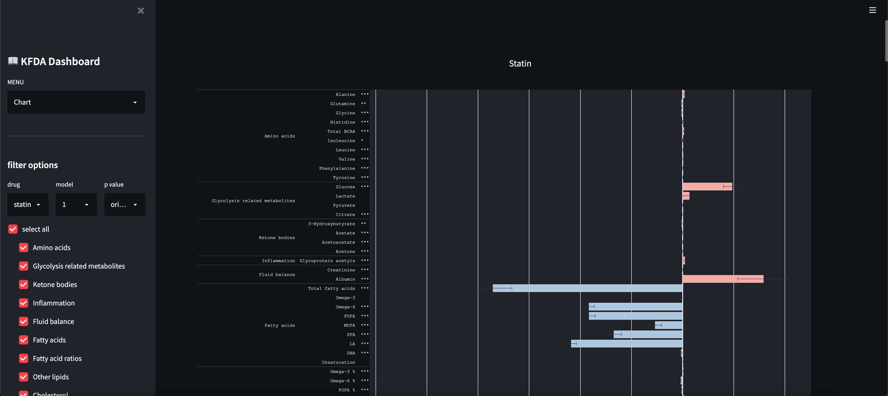
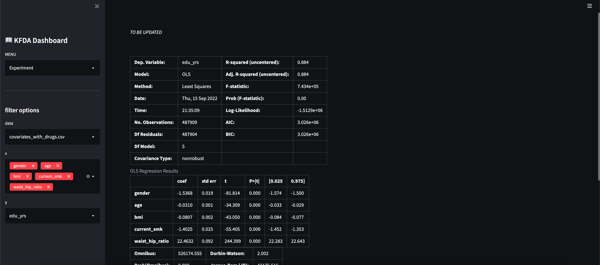

# drug-biomarker-dashboard
A customized dashboard that shows the analysis upon relationship between drug treatment and metabolites, which is created in KFDA project.

below are example screen shots
</img>
</img>